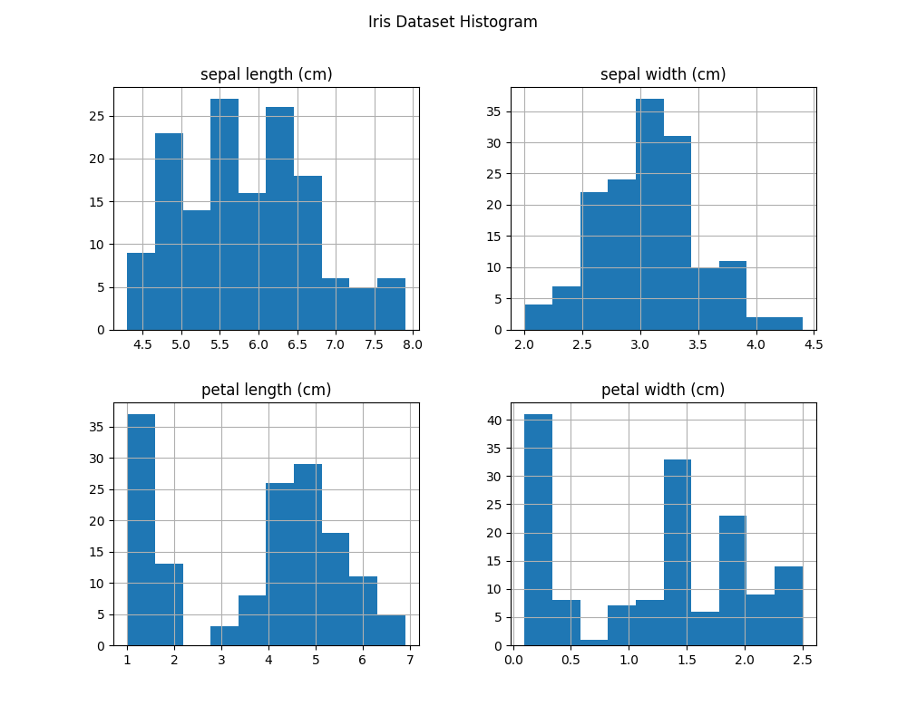
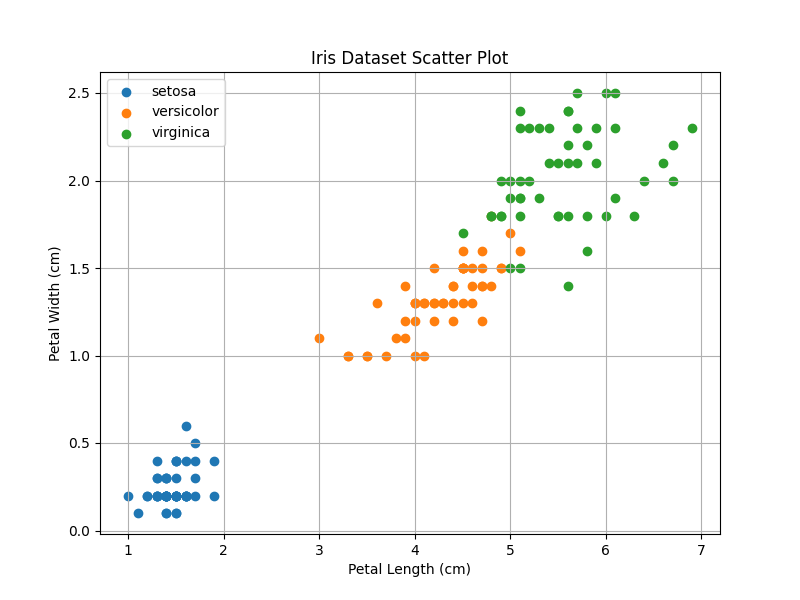
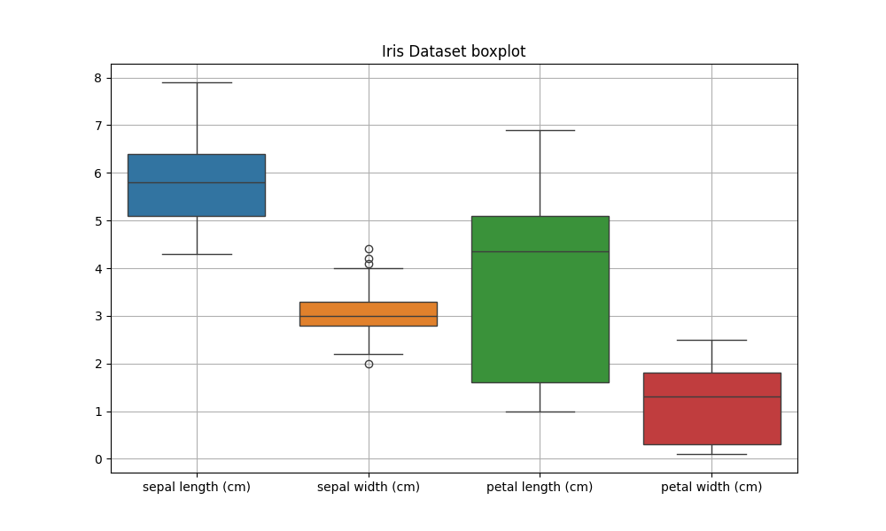

# Գլուխ 3 Ծրագրային մաս

## 3.1 Տվյալների հավաքածուի նկարագրություն

Դասակարգման մեթոդների կիրառումը ցուցադրելու նպատակով օգտագործվել է Iris տվյալների հավաքածուն, որը համարվում է մեքենայական ուսուցման ոլորտում ամենահայտնի և լայնորեն կիրառվող տվյալների հավաքածուներից մեկը։ Այն առաջին անգամ ներկայացվել է անգլիացի վիճակագիր Ռոնալդ Ֆիշերի կողմից և հաճախ օգտագործվում է դասակարգման ալգորիթմների փորձարկման և համեմատական վերլուծության համար։

Տվյալների հավաքածուն բաղկացած է 150 դիտարկումից, որոնք պատկանում են ծաղկի երեք տարբեր տեսակների՝ Iris Setosa, Iris Versicolor և Iris Virginica։ Յուրաքանչյուր տեսակ ներկայացված է 50 դիտարկումով, ինչը նշանակում է, որ տվյալների հավաքածուն ունի հավասարակշռված դասեր, և այդ պատճառով այն հարմար է դասակարգման մոդելների արդյունավետությունը գնահատելու համար։

Տվյալների հավաքածուում յուրաքանչյուր դիտարկում նկարագրվում է չորս քանակական հատկանիշների միջոցով, որոնք նկարագրում են ծաղկի բաժակաթերթերի և թերթիկների չափերը։ Դրանք են՝

- Sepal Length (բաժակաթերթի երկարություն)

- Sepal Width (բաժակաթերթի լայնություն)

- Petal Length (թերթիկի երկարություն)

- Petal Width (թերթիկի լայնություն)

Այս հատկանիշների արժեքները չափված են սանտիմետրերով և օգտագործվում են որպես մուտքային փոփոխականներ դասակարգման մոդելների կառուցման համար։

Հետազոտության հիմնական նպատակն է կիրառել դասակարգման տարբեր մեթոդներ և դրանց օգնությամբ կանխատեսել, թե տվյալ դիտարկումը որ տեսակի ծաղկին է պատկանում։ Այլ կերպ ասած՝ անհրաժեշտ է կառուցել մոդել, որը կարող է օգտագործելով վերոնշյալ չափողական հատկանիշները, ճիշտ դասակարգել նոր դիտարկումները համապատասխան դասերի մեջ։

Iris տվյալների հավաքածուն լայնորեն կիրառվում է, քանի որ այն ունի մի շարք կարևոր առավելություններ։ Տվյալների կառուցվածքը պարզ և հստակ է, ինչը թույլ է տալիս հեշտությամբ իրականացնել տվյալների նախնական վերլուծություն և գրաֆիկական ներկայացում։ Բացի այդ, տվյալների հավաքածուն համեմատաբար փոքր չափի է, ինչը հնարավորություն է տալիս արագ իրականացնել հաշվարկներ և փորձարկել տարբեր ալգորիթմներ։

Տվյալների հավաքածուն հասանելի է բաց աղբյուրից և ներբեռնվել է UCI Machine Learning Repository հարթակից։

Այսպիսով՝ Iris տվյալների հավաքածուն հանդիսանում է հարմար և դասական օրինակ դասակարգման խնդիրների ուսումնասիրության համար, քանի որ այն թույլ է տալիս կիրառել և համեմատել տարբեր դասակարգման մեթոդներ՝ գնահատելով դրանց արդյունավետությունը տվյալների վերլուծության գործընթացում։

## 3.2 Տվյալների նախնական վիճակագրական վերլուծություն

Այս փուլը կարևոր է, քանի որ այն թույլ է տալիս հասկանալ տվյալների ընդհանուր կառուցվածքը, ուսումնասիրել փոփոխականների բաշխումը և գնահատել դրանց հիմնական հատկությունները։ Նախնական վիճակագրական վերլուծությունը նաև օգնում է հասկանալ, թե տվյալները որքանով են հարմար դասակարգման մեթոդների կիրառման համար։

Անհրաժեշտ է հաշվարկել հիմնական վիճակագրական ցուցանիշները, որոնք նկարագրում են տվյալների բաշխումը։ Այդ ցուցանիշներից են՝ միջին արժեքը, մեդիանը, ստանդարտ շեղումը, տվյալների նվազագույն և առավելագույն արժեքները։ Այս ցուցանիշների օգնությամբ հնարավոր է գնահատել, թե ինչպես են տվյալները բաշխված և որքանով են դրանք կենտրոնացած միջին արժեքի շուրջ։

Միջին արժեքը ցույց է տալիս տվյալների կենտրոնական միտումը և հաշվարկվում է հետևյալ բանաձևով.

$$\overline{x} = \frac{1}{n}\sum_{i = 1}^{n}x_{i}$$

որտեղ

$x_{i}$ - տվյալների արժեքներն են,

$n$ - դիտարկումների ընդհանուր քանակը։

Մեդիանը այն արժեքն է, որը բաժանում է տվյալների շարքը երկու հավասար մասերի։

Տվյալների տարածվածությունը գնահատելու համար օգտագործվում է նաև ստանդարտ շեղումը, որը ցույց է տալիս, թե որքանով են տվյալները շեղված միջին արժեքից։ Ստանդարտ շեղումը հաշվարկվում է հետևյալ բանաձևով.

$$\sigma = \sqrt{\frac{1}{n}\sum_{i = 1}^{n}{{(x}_{i} - \overline{x})}^{2}}$$

որտեղ  
$\overline{x}$ - միջին արժեքն է։

Հաշվարկվում են նաև տվյալների նվազագույն և առավելագույն արժեքները, որոնք թույլ են տալիս գնահատել տվյալների ամբողջ միջակայքը։

Վերցված տվյալների հավաքածուի դեպքում ստացված ցուցանիշներն են՝

|                             | sepal length (cm) | sepal width (cm) | petal length (cm) | petal width (cm) |
|-----------------------------|-------------------|------------------|-------------------|------------------|
| Count(Դիտարկումների քանակը) | 150.000000        | 150.000000       | 150.000000        | 150.000000       |
| Mean(Միջին արժեք)           | 5.843333          | 3.057333         | 3.758000          | 1.199333         |
| Std(Ստանդարտ շեղում)        | 0.828066          | 0.435866         | 1.765298          | 0.762238         |
| Min(Նվազագույն արժեք)       | 4.300000          | 2.000000         | 1.000000          | 0.100000         |
| 25%(Առաջին քառորդական)      | 5.100000          | 2.800000         | 1.600000          | 0.300000         |
| 50%(Մեդիան)                 | 5.800000          | 3.000000         | 4.350000          | 1.300000         |
| 75%(Երրորդ քառորդական)      | 6.400000          | 3.300000         | 5.100000          | 1.800000         |
| Max(Առավելագույն արժեք)     | 7.900000          | 4.400000         | 6.900000          | 2.500000         |

## 3.3 Տվյալների գրաֆիկական վերլուծություն

Տվյալների նախնական վիճակագրական վերլուծությունից հետո հարկավոր է դրանք ուսումնասիրել գրաֆիկական տեսանկյունից։ Գրաֆիկական վերլուծությունը թույլ է տալիս ավելի հստակ հասկանալ տվյալների կառուցվածքը, տեսնել հատկանիշների բաշխումը, դասերի միջև տարբերությունները և ավելի հեշտ պատկերացնել փոփոխականների միջև կապերը։

Iris տվյալների հավաքածուի դեպքում գրաֆիկական վերլուծությունը հատկապես օգտակար է, քանի որ տվյալներն ունեն չորս քանակական հատկանիշ, և անհրաժեշտ է հասկանալ, թե որքանով են այդ հատկանիշները տարբերում իրիս ծաղկի երեք տեսակները միմյանցից։ Այս նպատակով կիրառվել են մի քանի հիմնական գրաֆիկական մեթոդներ, մասնավորապես՝ հիստոգրամներ, ցրման դիագրամներ և boxplot-ներ։

Հիստոգրամները թույլ են տալիս ուսումնասիրել յուրաքանչյուր հատկանիշի արժեքների բաշխումը։ Դրանց միջոցով կարելի է տեսնել, թե որ միջակայքերում են կենտրոնացած տվյալների մեծ մասը, ինչպես նաև հասկանալ՝ բաշխումը համեմատաբար սիմետրիկ է, թե ոչ։

Ցրման դիագրամները օգտագործվում են երկու փոփոխականների միջև կապը տեսնելու համար։ Դրանք հատկապես կարևոր են դասակարգման խնդիրներում, քանի որ թույլ են տալիս պատկերացնել, թե տարբեր դասերը որքանով են առանձնանում միմյանցից հատկանիշների հարթության մեջ։

Boxplot-ները հնարավորություն են տալիս ուսումնասիրել յուրաքանչյուր հատկանիշի բաշխման հիմնական հատկությունները, ներառյալ մեդիանը, քառորդականները և հնարավոր արտասովոր արժեքները։ Այսպիսի գրաֆիկները օգնում են հասկանալ, թե որքանով են տվյալները տարածված և արդյոք առկա են այնպիսի արժեքներ, որոնք կարող են ազդել հետագա վերլուծության վրա։

### 3.3.1 Հիստոգրամների միջոցով բաշխման ուսումնասիրություն

Sepal length հատկանիշի դեպքում տվյալների մեծ մասը գտնվում է մոտավորապես 5-ից 7 սանտիմետր միջակայքում։

Sepal width հատկանիշի բաշխումը համեմատաբար ավելի սեղմ է և կենտրոնացած է մոտավորապես 2.5-ից 3.5 սանտիմետր միջակայքում։

Petal length հատկանիշի դեպքում կարելի է նկատել, որ տվյալները բաշխված են ավելի լայն միջակայքում՝ մոտավորապես 1-ից 7 սանտիմետր։

Petal width հատկանիշի բաշխումը նույնպես բավականին տարբեր է տարբեր դիտարկումների դեպքում։ Տվյալների մի մասը կենտրոնացած է փոքր արժեքների մոտ, իսկ մյուս մասը՝ ավելի մեծ միջակայքերում։

Ընդհանուր առմամբ, հիստոգրամների վերլուծությունը ցույց է տալիս, որ Iris տվյալների հավաքածուի հատկանիշները ունեն տարբեր բաշխումներ, և որոշ հատկանիշներ ավելի արտահայտված փոփոխականություն ունեն:

### 3.3.2 Ցրման դիագրամների միջոցով հատկանիշների կապի ուսումնասիրություն

Setosa տեսակի կետերը կենտրոնացած են գրաֆիկի ստորին ձախ հատվածում, ինչը նշանակում է, որ այդ տեսակի ծաղիկների թերթիկները համեմատաբար փոքր չափեր ունեն։ Versicolor տեսակի կետերը գտնվում են միջին հատվածում, իսկ Virginica տեսակը հիմնականում տեղակայված է գրաֆիկի վերին աջ մասում։

Այսպիսի բաշխումը ցույց է տալիս, որ petal length և petal width հատկանիշները բավականին տարբերվում են տեսակից կախված ։

### 3.3.3 Boxplot-ի միջոցով բաշխման համեմատություն

Boxplot-ի միջոցով կարելի է տեսնել յուրաքանչյուր հատկանիշի մեդիանը, քառորդականները և արժեքների ընդհանուր միջակայքը։ Գրաֆիկից երևում է, որ petal length և petal width հատկանիշները ունեն ավելի մեծ տատանումներ, քան sepal width հատկանիշը։ Սա նշանակում է, որ այդ հատկանիշների արժեքները ավելի լայն միջակայքում են փոփոխվում։

Sepal width հատկանիշի դեպքում կարելի է նկատել նաև մի քանի \<\<արտասովոր արժեքներ\>\>(outliers), որոնք գրաֆիկում նշված են առանձին կետերով։ Boxplot-ի կառուցման ժամանակ արտասովոր արժեքները այն դիտարկումներն են, որոնց արժեքները գտնվում են առաջին և երրորդ քառորդականներից բավականին հեռու և դուրս են գալիս միջքառորդական միջակայքի սահմաններից։

Տվյալ դեպքում այդ կետերը ցույց են տալիս, որ որոշ ծաղիկների sepal width չափումը զգալիորեն տարբերվում է մյուս դիտարկումներից։ Սա կարող է պայմանավորված լինել տարբեր տեսակների կամ որոշ անհատական բույսերի չափերի տարբերությամբ։

## 3.4 Տվյալների նախապատրաստում դասակարգման համար

Այժմ անհրաժեշտ է իրականացնել տվյալների նախապատրաստում դասակարգման մեթոդների կիրառման համար։ Այս փուլում տվյալները կազմակերպվում են այնպես, որպեսզի հնարավոր լինի կառուցել և գնահատել դասակարգման մոդելները։

Դասակարգման խնդիրներում տվյալները սովորաբար բաժանվում են երկու հիմնական մասի՝ մուտքային հատկանիշների (features) և նպատակային փոփոխականի (target variable)։ Մուտքային հատկանիշները ներկայացնում են այն չափումները կամ բնութագրերը, որոնց հիման վրա իրականացվում է կանխատեսումը, իսկ նպատակային փոփոխականը ցույց է տալիս այն դասը, որին պատկանում է տվյալ դիտարկումը։

Iris տվյալների հավաքածուի դեպքում մուտքային հատկանիշներն են ծաղկի չափումները՝ sepal length, sepal width, petal length և petal width։ Նպատակային փոփոխականը ցույց է տալիս իրիսի տեսակը, որը կարող է լինել Setosa, Versicolor կամ Virginica։

Դասակարգման մոդելների կառուցման համար կարևոր քայլերից մեկն է տվյալների բաժանումը ուսուցման (training) և թեստային (test) ընտրանքների։ Ուսուցման տվյալները օգտագործվում են մոդելի մարզման համար, իսկ թեստային տվյալները՝ մոդելի աշխատանքի գնահատման նպատակով։ Այս մոտեցումը թույլ է տալիս ստանալ ավելի օբյեկտիվ պատկեր մոդելի արդյունավետության մասին։

Այս աշխատանքում տվյալները բաժանվել են այնպես, որ դիտարկումների 80%-ը օգտագործվում է ուսուցման համար, իսկ մնացած 20%-ը՝ մոդելի գնահատման համար։ Այս հարաբերակցությունը լայնորեն օգտագործվում է մեքենայական ուսուցման խնդիրներում, քանի որ այն ապահովում է բավարար տվյալներ մոդելի ուսուցման համար և միևնույն ժամանակ հնարավորություն է տալիս ստուգել դրա աշխատանքը նոր տվյալների վրա։

Տվյալների բաժանումից հետո ստացվում են չորս հիմնական տվյալների հավաքածուներ՝

- ուսուցման մուտքային տվյալներ (X_train)

- ուսուցման նպատակային փոփոխական (y_train)

- թեստային մուտքային տվյալներ (X_test)

- թեստային նպատակային փոփոխական (y_test)

## 3.5 Դասակարգման մեթոդների կիրառություն

Դասակարգուման նպատակն է տվյալ դիտարկումները դասակարգել համապատասխան խմբերի մեջ՝ հիմնվելով դրանց հատկանիշների վրա։

Այս աշխատանքում կիրառվել են երկու դասակարգման մեթոդներ՝ Logistic Regression և K-Nearest Neighbors (KNN)։

### 3.5.1 Logistic Regression մեթոդ

Logistic Regression-ը դասակարգման մեթոդ է, որը օգտագործվում է հավանականությունը գնահատելու համար, թե տվյալ դիտարկումը պատկանում է արդյոք որոշակի դասի։

Logistic Regression մոդելը հիմնված է լոգիստիկ ֆունկցիայի վրա, որը ապահովում է, որ կանխատեսվող արժեքը գտնվի 0-ից 1 միջակայքում։ Այդ արժեքը կարելի է մեկնաբանել որպես տվյալ դասին պատկանելու հավանականություն։

Լոգիստիկ ֆունկցիան ունի հետևյալ տեսքը․

$$P\left( Y = 1 \middle| X \right) = \ \frac{1}{1 + e^{- (\beta_{0} + \beta_{1}x_{1} + \beta_{2}x_{2} + \ldots + \beta_{n}x_{n})}}$$

որտեղ

$x_{1},x_{2},...,x_{n}$ - մուտքային հատկանիշներն են,  
$\beta_{0},\beta_{1},...$ - մոդելի պարամետրերն են։

Այս մոդելի միջոցով հնարավոր է հաշվարկել յուրաքանչյուր դիտարկման պատկանելու հավանականությունը տվյալ դասին և ընտրել այն դասը, որի հավանականությունը առավել մեծ է։

**Logistic Regression մեթոդի արդյունքների վերլուծությունը ընտրված տվյալների հավաքածուի համար**

Նախ տվյալների հավաքածուն բաժանվել էր ուսուցման և թեստային ընտրանքների։ Ուսուցման ընտրանքը պարունակում էր 120 դիտարկում, իսկ թեստային ընտրանքը՝ 30 դիտարկում։ Մոդելը ուսուցվեց ուսուցման տվյալների վրա և այնուհետև կիրառվեց թեստային տվյալների դասերի կանխատեսման համար։

Թեստային տվյալների իրական դասերը հետևյալն էին.

\[1 0 2 1 1 0 1 2 1 1 2 0 0 0 0 1 2 1 1 2 0 2 0 2 2 2 2 2 0 0\]

Այս արժեքները ներկայացնում են իրիսի երեք տեսակները թվային ձևով.

0 — setosa  
1 — versicolor  
2 — virginica

Այս արդյունքները ցույց են տալիս, որ մոդելը յուրաքանչյուր դիտարկման համար կանխատեսել է համապատասխան դասը։

Մոդելի արդյունավետությունը գնահատելու համար հաշվարկվել է accuracy ցուցանիշը, որը տվյալ դեպքում հավասար է.

Accuracy = 1.0

Սա նշանակում է, որ մոդելը ճիշտ է դասակարգել թեստային տվյալների բոլոր 30 դիտարկումները։ Այլ կերպ ասած, սխալ դասակարգումներ տվյալ դեպքում չեն եղել։

Արդյունքների ավելի մանրամասն ուսումնասիրության համար կառուցվել է նաև confusion matrix։ Ստացված մատրիցան ունի հետևյալ տեսքը.

$$\begin{bmatrix}
10 & 0 & 0 \\
0 & 9 & 0 \\
0 & 0 & 11
\end{bmatrix}
$$

Այս մատրիցայի գլխավոր անկյունագծում գտնվող արժեքները ցույց են տալիս ճիշտ դասակարգված դիտարկումների քանակը։

Մատրիցայի մնացած բջիջներում արժեքները հավասար են 0, ինչը նշանակում է, որ սխալ դասակարգումներ չեն եղել։

Բացի accuracy-ից հաշվարկվել են նաև դասակարգման հիմնական չափանիշները՝ precision, recall և F1-score։ Ստացված classification report-ը ցույց է տալիս հետևյալ արդյունքները.

setosa - precision = 1.00, recall = 1.00, F1-score = 1.00  
versicolor - precision = 1.00, recall = 1.00, F1-score = 1.00  
virginica - precision = 1.00, recall = 1.00, F1-score = 1.00

Այս ցուցանիշները ցույց են տալիս, որ մոդելը բոլոր դասերի համար ապահովել է լիովին ճիշտ դասակարգում։

Այսպիսի բարձր արդյունքը պայմանավորված է նաև այն հանգամանքով, որ Iris տվյալների հավաքածուում որոշ հատկանիշներ, հատկապես petal length և petal width, տեսակից կախված բավականին նկատելի տարբերվում են միմյանցից։ Այդ պատճառով Logistic Regression մոդելը կարողանում է հեշտությամբ առանձնացնել տարբեր դասերը և ապահովել շատ բարձր ճշգրտություն։

### 3.5.2 K-Nearest Neighbors մեթոդ

K-Nearest Neighbors (KNN) մեթոդը դասակարգման ալգորիթմ է, որը հիմնված է տվյալների միջև հեռավորությունների հաշվարկի վրա։ Այս մեթոդի գաղափարն այն է, որ նոր դիտարկումը դասակարգվում է այն դասի մեջ, որը առավել հաճախ հանդիպում է նրա ամենամոտ հարևանների մեջ։

Այս մեթոդի աշխատանքի հիմնական քայլերն են․

1.  հաշվարկել տվյալ դիտարկման հեռավորությունը մյուս բոլոր դիտարկումներից

2.  ընտրել K ամենամոտ հարևանները

3.  որոշել դիտարկման դասը՝ ըստ հարևանների մեծամասնության

Հաճախ օգտագործվում է Էվկլիդյան հեռավորությունը, որը հաշվարկվում է հետևյալ բանաձևով․

$$d(x,\ y) = \ \sqrt{\sum_{i = 1}^{n}{(x_{i} - y_{i})}^{2}}$$

որտեղ

$x_{i}$ և $y_{i}$ - համապատասխան հատկանիշների արժեքներն են։

**K-Nearest Neighbors մեթոդի արդյունքների վերլուծությունը ընտրված տվյալների հավաքածուի համար**

Ուսուցման ընտրանքը բաղկացած էր 120 դիտարկումից, իսկ թեստային ընտրանքը՝ 30 դիտարկումից։

Թեստային տվյալների իրական դասերը ներկայացված են հետևյալ թվային արժեքներով.

\[1 0 2 1 1 0 1 2 1 1 2 0 0 0 0 1 2 1 1 2 0 2 0 2 2 2 2 2 0 0\]

Այստեղ նույնպես դասերը ներկայացված են հետևյալ կերպ.

0 — setosa  
1 — versicolor  
2 — virginica

Ինչպես երևում է, մոդելի կանխատեսումները ամբողջությամբ համապատասխանում են իրական դասերին։

Մոդելի արդյունավետությունը գնահատելու համար հաշվարկվել է accuracy ցուցանիշը, որի արժեքը ստացել ենք.

Accuracy = **1.0**

Սա նշանակում է, որ KNN մոդելը նույնպես ճիշտ է դասակարգել թեստային տվյալների բոլոր 30 դիտարկումները։

Արդյունքների ավելի մանրամասն վերլուծության համար կառուցվել է նաև confusion matrix։ Ստացված մատրիցան ունի հետևյալ տեսքը.

$$\begin{bmatrix}
10 & 0 & 0 \\
0 & 9 & 0 \\
0 & 0 & 11
\end{bmatrix}
$$

Այս մատրիցան ցույց է տալիս, որ.

- setosa տեսակի բոլոր 10 դիտարկումները ճիշտ են դասակարգվել

- versicolor տեսակի բոլոր 9 դիտարկումները ճիշտ են դասակարգվել

- virginica տեսակի բոլոր 11 դիտարկումները նույնպես ճիշտ են դասակարգվել

Մատրիցայի մյուս բոլոր բջիջներում արժեքները հավասար են 0, ինչը նշանակում է, որ սխալ դասակարգումներ չեն եղել։

Բացի accuracy-ից հաշվարկվել են նաև դասակարգման հիմնական չափանիշները՝ precision, recall և F1-score։ Ստացված classification report-ը ցույց է տալիս, որ բոլոր երեք դասերի համար այս ցուցանիշները հավասար են 1.00։

Այս արդյունքները ցույց են տալիս, որ KNN մոդելը նույնպես ապահովում է շատ բարձր դասակարգման ճշգրտություն տվյալ տվյալների հավաքածուի դեպքում։

**3.6 Մեթոդների համեմատական վերլուծություն**

Logistic Regression և K-Nearest Neighbors (KNN) մոդելների դեպքում տվյալների հավաքածուն բաժանվել էր ուսուցման և թեստային ընտրանքների։ Ուսուցման ընտրանքը պարունակում էր 120 դիտարկում, իսկ թեստային ընտրանքը՝ 30 դիտարկում։

Մոդելների արդյունավետությունը գնահատվել է accuracy, precision, recall և F1-score ցուցանիշների միջոցով։ Ստացված արդյունքները ներկայացված են ստորև.

| **Մեթոդ**           | **Accuracy** |
|---------------------|--------------|
| Logistic Regression | 1.0          |
| K-Nearest Neighbors | 1.0          |

Ինչպես երևում է աղյուսակից, երկու մեթոդներն էլ տվյալ տվյալների հավաքածուի դեպքում ապահովել են 100% ճշգրտություն։ Երկու մոդելներն էլ ճիշտ են դասակարգել թեստային տվյալների բոլոր 30 դիտարկումները։

Confusion matrix-ի վերլուծությունը նույնպես ցույց է տալիս, որ երկու մոդելների դեպքում սխալ դասակարգումներ չեն եղել։ Setosa տեսակի բոլոր 10 դիտարկումները, versicolor տեսակի 9 դիտարկումները և virginica տեսակի 11 դիտարկումները ճիշտ են դասակարգվել երկու մոդելների կողմից։

Classification report-ի արդյունքները նույնպես ցույց են տալիս, որ precision, recall և F1-score ցուցանիշները բոլոր դասերի համար հավասար են 1.00։ Սա նշանակում է, որ մոդելները ոչ միայն ճիշտ են դասակարգել դիտարկումները, այլ նաև ապահովել են հավասարապես բարձր արդյունքներ բոլոր դասերի համար։

Այն հանգամանքը, որ երկու մեթոդներն էլ ապահովել են նույն արդյունքը, պայմանավորված է Iris տվյալների հավաքածուի կառուցվածքով

Այսպիսով, կարելի է եզրակացնել, որ տվյալ տվյալների հավաքածուի դեպքում թե՛ Logistic Regression, թե՛ K-Nearest Neighbors մեթոդները ապահովում են շատ բարձր արդյունավետություն և հաջողությամբ լուծում են դասակարգման խնդիրը։
