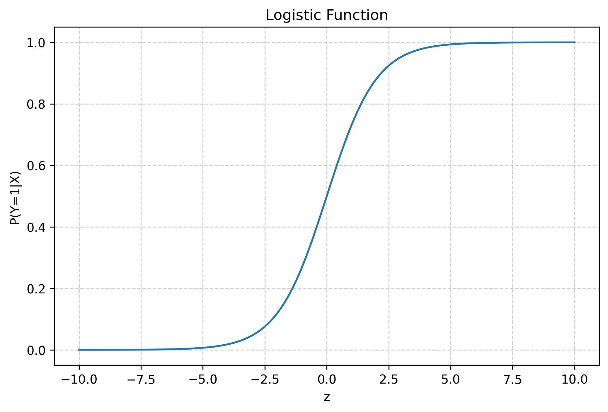
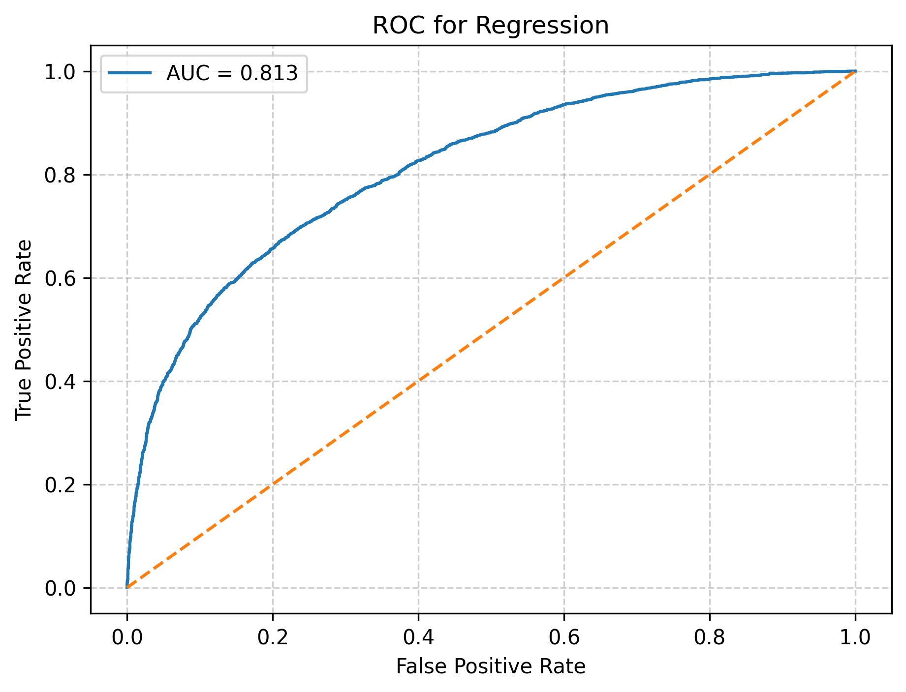
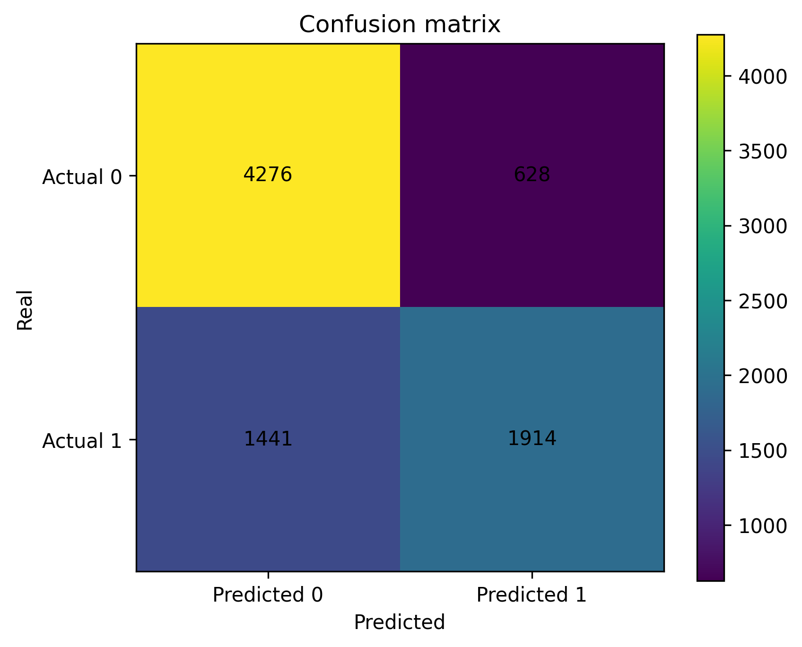
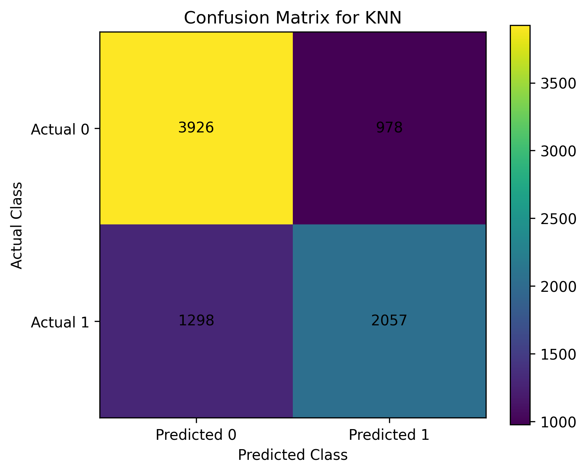
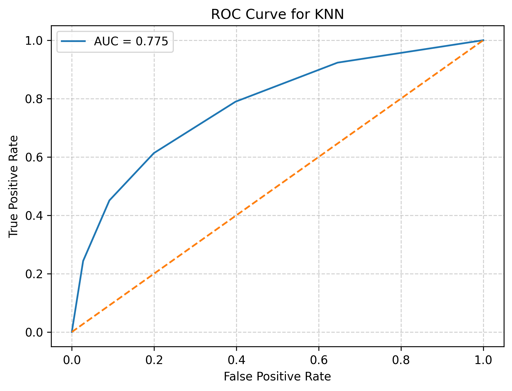

# 3.1 Տվյալների հավաքածուի նկարագրություն և խնդրի ձևակերպում

Այս աշխատանքում դասակարգման մեթոդների կիրառությունը ուսումնասիրելու նպատակով օգտագործվել է COVID-19 հիվանդների վերաբերյալ տվյալների հավաքածու։ Տվյալների հավաքածուն ներբեռնվել է բաց տվյալների հարթակից՝ Kaggle կայքից։

## Հատկանիշների նկարագրություն

Տվյալների հավաքածուում ներկայացված հատկանիշների մեծ մասը հանդիսանում են բինար (boolean) փոփոխականներ, որոնց դեպքում արժեքը 1 նշանակում է «այո», իսկ 2 նշանակում է «ոչ»։ Որոշ դաշտերում հանդիպող 97, 98 և 99 արժեքները ներկայացնում են բացակայող կամ անհայտ տվյալներ։

Տվյալների հավաքածուում ներառված հիմնական հատկանիշները հետևյալն են.

- **sex** - հիվանդի սեռը։ 1 - իգական, 2 - արական։
- **age** - հիվանդի տարիքը։
- **classification_final** – covid-19 թեստի վերջնական արդյունքը։ 1-3 արժեքները նշանակում են, որ հիվանդը վարակված է covid-19-ով տարբեր աստիճաններով, իսկ 4 և ավելի արժեքները նշանակում են, որ հիվանդը վարակված չէ կամ թեստի արդյունքը անորոշ է։
- **patient_type** - բուժման տեսակը։ 1 - հիվանդը ստացել է ամբուլատոր բուժում և վերադարձել է տուն, 2 - հիվանդը հոսպիտալացվել է։
- **pneumonia** – ցույց է տալիս, արդյոք հիվանդի մոտ առկա է թոքաբորբ։
- **pregnancy** – ցույց է տալիս, արդյոք հիվանդը հղի է։
- **diabetes** – ցույց է տալիս շաքարային դիաբետի առկայությունը։
- **copd** – ցույց է տալիս քրոնիկական օբստրուկտիվ թոքային հիվանդության առկայությունը։
- **asthma** – ցույց է տալիս ասթմայի առկայությունը հիվանդի մոտ։
- **inmsupr** – ցույց է տալիս, արդյոք հիվանդը ունի թուլացած իմունային համակարգ։
- **hypertension** – ցույց է տալիս բարձր արյան ճնշման առկայությունը։
- **cardiovascular** – ցույց է տալիս սրտանոթային հիվանդությունների առկայությունը։
- **renal_chronic** – ցույց է տալիս քրոնիկական երիկամային հիվանդության առկայությունը։
- **other_disease** – ցույց է տալիս այլ ուղեկցող հիվանդությունների առկայությունը։
- **obesity** – ցույց է տալիս գիրության առկայությունը հիվանդի մոտ։
- **tobacco** – ցույց է տալիս, արդյոք հիվանդը ծխող է։
- **usmer** – ցույց է տալիս, արդյոք հիվանդը բուժվել է առաջին, երկրորդ կամ երրորդ մակարդակի բժշկական հաստատությունում։
- **medical_unit** – բժշկական հաստատության տեսակը, որը տրամադրել է բուժումը։
- **intubed** – ցույց է տալիս, արդյոք հիվանդը միացված է եղել շնչառական ապարատին։
- **icu** – ցույց է տալիս, արդյոք հիվանդը գտնվել է ինտենսիվ թերապիայի բաժանմունքում։
- **date_died** – հիվանդի մահվան ամսաթիվը։ Եթե արժեքը 9999-99-99 է, նշանակում է հիվանդը չի մահացել։

## Խնդրի ձևակերպում

Այս աշխատանքի հիմնական նպատակն է կանխատեսել COVID-19 հիվանդի առողջական վիճակի ռիսկի մակարդակը՝ հիմնվելով հիվանդի առողջական տվյալների, ախտանիշների և բժշկական պատմության վրա։

Տվյալների հավաքածուում ներկայացված տարբեր բժշկական հատկանիշները կարող են ազդել հիվանդության ընթացքի և դրա ծանրության վրա։ Այդ պատճառով այս աշխատանքում դիտարկվում է դասակարգման խնդիր, որի նպատակն է որոշել, թե արդյոք տվյալ հիվանդը գտնվում է բարձր ռիսկային խմբում, թե ոչ։

Նպատակային փոփոխականը ներկայացվում է երկու դասերով․

- **1** - բարձր ռիսկ (high risk)
- **0** - ցածր ռիսկ (low risk)

Խնդրի լուծման համար կիրառվում են մեքենայական ուսուցման երկու դասակարգման մեթոդներ՝

- Logistic Regression
- K-Nearest Neighbors (KNN)

Այս մեթոդների միջոցով կառուցված մոդելները հետագայում կգնահատվեն և կհամեմատվեն՝ օգտագործելով համապատասխան գնահատման չափանիշներ, ինչպիսիք են accuracy, precision, recall և F1-score, որպեսզի գնահատվի դրանց արդյունավետությունը տվյալ տվյալների հավաքածուի դեպքում։

---

# 3.2 Տվյալների նախնական վիճակագրական վերլուծություն

Նախնական վիճակագրական վերլուծությունը թույլ է տալիս հասկանալ տվյալների բաշխումը, հայտնաբերել հնարավոր արտասովոր արժեքներ և գնահատել տվյալների համապատասխանությունը հետագա մեքենայական ուսուցման մոդելների կիրառման համար։

Քանակական հատկանիշների համար հաշվարկվում են հետևյալ հիմնական ցուցանիշները.

- միջին արժեք (mean)
- մեդիան (median)
- ստանդարտ շեղում (standard deviation)
- նվազագույն արժեք (minimum)
- առավելագույն արժեք (maximum)

Միջին արժեքը ցույց է տալիս տվյալների կենտրոնական միտումը և հաշվարկվում է հետևյալ բանաձևով.

$$
\bar{x} = \frac{1}{n} \sum_{i=1}^{n} x_i
$$

որտեղ

- $x_i$ - տվյալների արժեքներն են,
- $n$ - դիտարկումների ընդհանուր քանակը։

Մեդիանը այն արժեքն է, որը բաժանում է տվյալների շարքը երկու հավասար մասերի։

Տվյալների տարածվածությունը գնահատելու համար օգտագործվում է ստանդարտ շեղումը, որը ցույց է տալիս, թե որքանով են տվյալները շեղված միջին արժեքից։ Ստանդարտ շեղումը հաշվարկվում է հետևյալ բանաձևով.

$$
\sigma = \sqrt{\frac{1}{n} \sum_{i=1}^{n} (x_i - \bar{x})^2}
$$

որտեղ

- $\bar{x}$ - միջին արժեքն է։

Հաշվարկվում են նաև տվյալների նվազագույն և առավելագույն արժեքները, որոնք թույլ են տալիս գնահատել տվյալների ամբողջ միջակայքը։

Այս տվյալների դեպքում քանակական հատկանիշ է․

- **age**

Բացի քանակական հատկանիշներից, տվյալների հավաքածուում առկա են նաև բինար և կատեգորիական հատկանիշներ։ Այսպիսի հատկանիշները ներկայացնում են որոշակի վիճակի կամ հատկության առկայությունը և սովորաբար ունեն սահմանափակ թվով հնարավոր արժեքներ։

Բինար հատկանիշների դեպքում տվյալների արժեքները կարող են ընդունել երկու հիմնական արժեք.

- **1** - այո (առկա է)
- **2** - ոչ (առկա չէ)

Տվյալների հավաքածուում բինար հատկանիշներ են.

- **pneumonia**
- **pregnancy**
- **diabetes**
- **copd**
- **asthma**
- **inmsupr**
- **hypertension**
- **cardiovascular**
- **renal_chronic**
- **other_disease**
- **obesity**
- **tobacco**
- **intubed**
- **icu**
- **usmer**
- **sex**

Այս հատկանիշների դեպքում հաշվարկվում է յուրաքանչյուր արժեքի հաճախականությունը (frequency), որը ցույց է տալիս, թե տվյալների հավաքածուում քանի դիտարկում ունի տվյալ հատկանիշի կոնկրետ արժեքը։

Հաճախականությունը հաշվարկվում է հետևյալ ձևով.

$$
f_i = \frac{n_i}{n}
$$

որտեղ

- $n_i$ - տվյալ արժեք ունեցող դիտարկումների քանակն է,
- $n$ - դիտարկումների ընդհանուր քանակը։

Կատեգորիական հատկանիշների դեպքում հաշվարկվում է յուրաքանչյուր կատեգորիայի դիտարկումների քանակը և դրանց հարաբերական հաճախականությունը։

Այս տվյալների հավաքածուում կատեգորիական հատկանիշներն են.

- **medical_unit**
- **patient_type**
- **classification_final**

## Հատուկ փոփոխական

**date_died**

Այս փոփոխականը ներկայացնում է հիվանդի մահվան ամսաթիվը։

- եթե արժեքը 9999-99-99 է, նշանակում է հիվանդը չի մահացել
- այլ դեպքում նշվում է մահվան ամսաթիվը

Այն օգտագործվում է նպատակային փոփոխական (target) կառուցելու համար։

## 3.2.1 Վիճակագրական հաշվարկների արդյունքներ

### Քանակական հատկանիշի վիճակագրական ցուցանիշներ

**age**

| Ցուցանիշ | Արժեք |
|---|---:|
| դիտարկումների քանակ | 1048575 |
| միջին արժեք (mean) | 41.79 |
| մեդիան (median) | 40 |
| ստանդարտ շեղում | 16.91 |
| նվազագույն արժեք | 0 |
| առավելագույն արժեք | 121 |

### Բինար հատկանիշների բաշխման ուսումնասիրություն

Բինար հատկանիշների դեպքում հաշվարկվել է յուրաքանչյուր արժեքի հաճախականությունը, որը ցույց է տալիս, թե տվյալների հավաքածուում քանի դիտարկում ունի տվյալ հատկանիշի կոնկրետ արժեքը։ Հետևյալ աղյուսակներում տրված են հատկանիշի արժեքը, դիտարկումների քանակը և հաճախականությունը։ Աղյուսակներում առկա 99, 98, 97 արժեքները չեն օգտագործվելու հետագա վերլուծությունների մեջ, քանի որ հանդիսանում են բացակայող արժեք։

**pneumonia**

| Արժեք | դիտարկումների քանակ | հաճախականություն |
|---|---:|---:|
| 1 | 140038 | 0.1336 |
| 2 | 892534 | 0.8512 |
| 99 | 16003 | 0.0153 |

**pregnant**

| Արժեք | դիտարկումների քանակ | հաճախականություն |
|---|---:|---:|
| 1 | 8131 | 0.0078 |
| 2 | 513179 | 0.4894 |
| 97 | 523511 | 0.4993 |
| 98 | 3754 | 0.0036 |

**diabetes**

| Արժեք | դիտարկումների քանակ | հաճախականություն |
|---|---:|---:|
| 1 | 124989 | 0.1192 |
| 2 | 920248 | 0.8776 |
| 98 | 3338 | 0.0032 |

**copd**

| Արժեք | դիտարկումների քանակ | հաճախականություն |
|---|---:|---:|
| 1 | 15062 | 0.0144 |
| 2 | 1030510 | 0.9828 |
| 98 | 3003 | 0.0029 |

**asthma**

| Արժեք | դիտարկումների քանակ | հաճախականություն |
|---|---:|---:|
| 1 | 31572 | 0.0301 |
| 2 | 1014024 | 0.9671 |
| 98 | 2979 | 0.0028 |

**inmsupr**

| Արժեք | դիտարկումների քանակ | հաճախականություն |
|---|---:|---:|
| 1 | 14170 | 0.0135 |
| 2 | 1031001 | 0.9832 |
| 98 | 3404 | 0.0032 |

**hypertension**

| Արժեք | դիտարկումների քանակ | հաճախականություն |
|---|---:|---:|
| 1 | 162729 | 0.1552 |
| 2 | 882742 | 0.8418 |
| 98 | 3104 | 0.0030 |

**cardiovascular**

| Արժեք | դիտարկումների քանակ | հաճախականություն |
|---|---:|---:|
| 1 | 20769 | 0.0198 |
| 2 | 1024730 | 0.9773 |
| 98 | 3076 | 0.0029 |

**renal_chronic**

| Արժեք | դիտարկումների քանակ | հաճախականություն |
|---|---:|---:|
| 1 | 18904 | 0.0180 |
| 2 | 1026665 | 0.9791 |
| 98 | 3006 | 0.0029 |

**other_disease**

| Արժեք | դիտարկումների քանակ | հաճախականություն |
|---|---:|---:|
| 1 | 28040 | 0.0267 |
| 2 | 1015490 | 0.9684 |
| 98 | 5045 | 0.0048 |

**obesity**

| Արժեք | դիտարկումների քանակ | հաճախականություն |
|---|---:|---:|
| 1 | 159816 | 0.1524 |
| 2 | 885727 | 0.8447 |
| 98 | 3032 | 0.0029 |

**tobacco**

| Արժեք | դիտարկումների քանակ | հաճախականություն |
|---|---:|---:|
| 1 | 84376 | 0.0805 |
| 2 | 960979 | 0.9165 |
| 98 | 3220 | 0.0031 |

**intubed**

| Արժեք | դիտարկումների քանակ | հաճախականություն |
|---|---:|---:|
| 1 | 33656 | 0.0321 |
| 2 | 159050 | 0.1517 |
| 97 | 848544 | 0.8092 |
| 99 | 7325 | 0.0070 |

**icu**

| Արժեք | դիտարկումների քանակ | հաճախականություն |
|---|---:|---:|
| 1 | 16858 | 0.0161 |
| 2 | 175685 | 0.1675 |
| 97 | 848544 | 0.8092 |
| 99 | 7488 | 0.0071 |

**usmer**

| Արժեք | դիտարկումների քանակ | հաճախականություն |
|---|---:|---:|
| 1 | 385672 | 0.367806 |
| 2 | 662903 | 0.632194 |

**sex**

| Արժեք | դիտարկումների քանակ | հաճախականություն |
|---|---:|---:|
| 1 | 525064 | 0.5007 |
| 2 | 523511 | 0.4993 |

### Կատեգորիական հատկանիշների բաշխման ուսումնասիրություն

Կատեգորիական հատկանիշների դեպքում հաշվարկվել է յուրաքանչյուր կատեգորիայի դիտարկումների քանակը և դրանց հարաբերական հաճախականությունը։

**medical_unit**

| Արժեք | դիտարկումների քանակ | հաճախականություն |
|---|---:|---:|
| 1 | 151 | 0.000144 |
| 2 | 169 | 0.000161 |
| 3 | 19175 | 0.018287 |
| 4 | 314405 | 0.299840 |
| 5 | 7244 | 0.006908 |
| 6 | 40584 | 0.038704 |
| 7 | 891 | 0.000850 |
| 8 | 10399 | 0.009917 |
| 9 | 38116 | 0.036350 |
| 10 | 7873 | 0.007508 |
| 11 | 5577 | 0.005319 |
| 12 | 602995 | 0.575061 |
| 13 | 996 | 0.000950 |

**patient_type**

| Արժեք | դիտարկումների քանակ | հաճախականություն |
|---|---:|---:|
| 1 | 848544 | 0.809235 |
| 2 | 200031 | 0.190765 |

**classification_final**

| Արժեք | դիտարկումների քանակ | հաճախականություն |
|---|---:|---:|
| 1 | 8601 | 0.008203 |
| 2 | 1851 | 0.001765 |
| 3 | 381527 | 0.363853 |
| 4 | 3122 | 0.002977 |
| 5 | 26091 | 0.024882 |
| 6 | 128133 | 0.122197 |
| 7 | 499250 | 0.476122 |

---

# 3.3 Լոգիստիկ ռեգրեսիայի վիճակագրական մոդել

Լոգիստիկ ռեգրեսիան վիճակագրական մեթոդ է, որը կիրառվում է այն դեպքերում, երբ նպատակային փոփոխականը ունի երկու հնարավոր արժեք։ Այսպիսի խնդիրները կոչվում են բինար դասակարգման խնդիրներ։ Լոգիստիկ ռեգրեսիայի նպատակը գնահատելն է որոշակի իրադարձության տեղի ունենալու հավանականությունը՝ հիմնվելով մի քանի բացատրող կամ կանխատեսող փոփոխականների վրա։

Այս մեթոդը լայնորեն կիրառվում է տարբեր ոլորտներում, հատկապես բժշկական տվյալների վերլուծության մեջ, որտեղ հաճախ անհրաժեշտ է կանխատեսել հիվանդության առաջացման կամ ծանր ընթացքի հավանականությունը՝ հիմնվելով հիվանդի առողջական տվյալների վրա։

Լոգիստիկ ռեգրեսիան թույլ է տալիս գնահատել հավանականությունը, որ դիտարկումը պատկանում է որոշակի դասի։ Եթե այդ հավանականությունը գերազանցում է որոշակի շեմային արժեք (օրինակ՝ 0.5), ապա դիտարկումը դասակարգվում է որպես դրական դեպք, հակառակ դեպքում՝ բացասական։

## Լոգիստիկ ֆունկցիա

Լոգիստիկ ռեգրեսիայի հիմքում ընկած է լոգիստիկ ֆունկցիան, որը սահմանվում է հետևյալ կերպ․

$$
P(Y=1 \mid X) = \frac{1}{1 + e^{-z}}
$$

որտեղ

$$
z = \beta_0 + \beta_1 x_1 + \beta_2 x_2 + \dots + \beta_k x_k
$$

Այստեղ

- $x_1, x_2, \dots, x_k$ - կանխատեսող փոփոխականներն են,
- $\beta_0$ - ազատ անդամն է,
- $\beta_1, \beta_2, \dots, \beta_k$ - մոդելի գործակիցներն են։

Այս ֆունկցիայի կարևոր հատկությունն այն է, որ այն միշտ վերադարձնում է 0-ից 1 միջակայքում գտնվող արժեքներ, որոնք կարելի է մեկնաբանել որպես հավանականություններ։

Լոգիստիկ ֆունկցիայի գրաֆիկը ունի S-աձև տեսք և ցույց է տալիս, թե ինչպես է փոփոխվում իրադարձության հավանականությունը կախված բացատրող փոփոխականներից։

## Logit փոխակերպում

Լոգիստիկ ռեգրեսիան իրականում մոդելավորում է ոչ թե հավանականությունը, այլ այդ հավանականության լոգարիթմական հարաբերությունը, որը կոչվում է logit։

Logit ֆունկցիան սահմանվում է հետևյալ կերպ․

$$
\log\left(\frac{p}{1-p}\right)
$$

որտեղ $p$-ը իրադարձության հավանականությունն է։ Այսպիսով լոգիստիկ ռեգրեսիայի մոդելը կարելի է ներկայացնել հետևյալ ձևով․

$$
\log\left(\frac{p}{1-p}\right) = \beta_0 + \beta_1 x_1 + \beta_2 x_2 + \dots + \beta_k x_k
$$

Այս փոխակերպումը թույլ է տալիս հավանականությունների ոչ գծային կախվածությունը ներկայացնել գծային մոդելի տեսքով։

## Պարամետրերի գնահատում

Լոգիստիկ ռեգրեսիայի մոդելի գործակիցները գնահատվում են առավելագույն հավանականության մեթոդի (Maximum Likelihood Estimation) միջոցով։ Այս մեթոդի նպատակն է գտնել այնպիսի պարամետրերի արժեքներ, որոնց դեպքում դիտարկված տվյալների ստացման հավանականությունը առավելագույնն է։

Հավանականության ֆունկցիան կարելի է ներկայացնել հետևյալ ձևով․

$$
L(\beta) = \prod_{i=1}^{n} p_i^{y_i}(1-p_i)^{(1-y_i)}
$$

որտեղ

- $y_i$ — նպատակային փոփոխականի արժեքն է,
- $p_i$ — մոդելի կողմից հաշվարկված հավանականությունը։

Այս մեթոդը թույլ է տալիս գնահատել մոդելի պարամետրերը այնպես, որ ստացված մոդելը լավագույնս նկարագրի տվյալները։

## Գործակիցների մեկնաբանություն

Լոգիստիկ ռեգրեսիայի գործակիցները հաճախ մեկնաբանվում են odds ratio-ի միջոցով։ Odds ratio-ն ցույց է տալիս, թե որքանով է փոխվում իրադարձության հավանականությունը տվյալ փոփոխականի փոփոխության դեպքում։

Odds ratio-ն հաշվարկվում է հետևյալ կերպ․

$$
OR = e^{\beta}
$$

Եթե odds ratio-ի արժեքը մեծ է 1-ից, ապա տվյալ փոփոխականը մեծացնում է իրադարձության տեղի ունենալու հավանականությունը։ Եթե այն փոքր է 1-ից, ապա տվյալ փոփոխականը նվազեցնում է այդ հավանականությունը։

Այսպիսի մեկնաբանությունը լայնորեն կիրառվում է բժշկական և սոցիալական հետազոտություններում։

# 3.4 Լոգիստիկ ռեգրեսիայի մոդելի կառուցում և կիրառություն

## 3.4.1 Տվյալների նախապատրաստում

Մեքենայական ուսուցման մոդելի կառուցումից առաջ անհրաժեշտ է նախապատրաստել տվյալները։ Նախապատրաստման ընթացքում իրականացվել են հետևյալ քայլերը.

Առաջին հերթին մշակվել են բացակայող կամ անհայտ տվյալները։ Տվյալների հավաքածուում որոշ հատկանիշների դեպքում հանդիպում են 97, 98 և 99 արժեքներ, որոնք ներկայացնում են բացակայող կամ անհայտ տվյալներ։ Այսպիսի արժեքները փոխարինվել են բացակայող արժեքներով կամ հեռացվել են տվյալների մշակման ընթացքում։

Այնուհետև կառուցվել է նպատակային փոփոխականը։ Տվյալների հավաքածուում առկա **date_died** փոփոխականի հիման վրա ստեղծվել է նոր բինար փոփոխական, որը ցույց է տալիս հիվանդության ռիսկի մակարդակը։

- **1** - բարձր ռիսկ (հիվանդը մահացել է)
- **0** - ցածր ռիսկ (հիվանդը չի մահացել)

Այս փոփոխականը օգտագործվել է որպես նպատակային փոփոխական մոդելի ուսուցման համար։

## 3.4.2 Տվյալների բաժանում ուսուցման և փորձարկման խմբերի

Մոդելի արդյունավետությունը գնահատելու համար տվյալների հավաքածուն բաժանվել է երկու մասի.

- ուսուցման տվյալներ (training set)
- փորձարկման տվյալներ (test set)

Սովորաբար տվյալների մոտավորապես 80%-ը օգտագործվում է ուսուցման համար, իսկ 20%-ը՝ մոդելի փորձարկման համար։

## 3.4.3 Մոդելի գնահատման չափանիշներ

Տվյալների նախապատրաստումից հետո կիրառվել է Logistic Regression դասակարգման մեթոդը։

Լոգիստիկ ռեգրեսիայի մոդելի արդյունավետությունը գնահատվել է մի քանի հիմնական չափանիշների միջոցով.

- accuracy
- precision
- recall
- F1-score

Լոգիստիկ ռեգրեսիայի մոդելի աշխատանքի արդյունավետությունը գնահատելու համար օգտագործվում են մի քանի հիմնական չափանիշներ։ Այս չափանիշները թույլ են տալիս գնահատել, թե որքան ճիշտ է մոդելը դասակարգում դիտարկումները։

Accuracy-ն ցույց է տալիս, թե մոդելը ընդհանուր դիտարկումների քանի տոկոսն է ճիշտ դասակարգել։ Այն հաշվարկվում է հետևյալ բանաձևով.

$$
\text{Accuracy} = \frac{TP + TN}{TP + TN + FP + FN}
$$

որտեղ

- **TP (True Positive)** - ճիշտ կանխատեսված դրական դեպքեր
- **TN (True Negative)** - ճիշտ կանխատեսված բացասական դեպքեր
- **FP (False Positive)** - սխալ դրական կանխատեսումներ
- **FN (False Negative)** - սխալ բացասական կանխատեսումներ

Այս չափանիշը ցույց է տալիս մոդելի ընդհանուր ճշգրտությունը։

Precision-ը ցույց է տալիս, թե մոդելի կողմից դրական կանխատեսված դեպքերից քանիսն են իրականում դրական։

$$
\text{Precision} = \frac{TP}{TP + FP}
$$

Այս չափանիշը կարևոր է այն դեպքերում, երբ սխալ դրական կանխատեսումները ցանկալի չեն։

Recall-ը (կամ զգայունություն) ցույց է տալիս, թե իրական դրական դեպքերից քանիսն է մոդելը ճիշտ հայտնաբերել։

$$
\text{Recall} = \frac{TP}{TP + FN}
$$

Այս չափանիշը կարևոր է հատկապես բժշկական խնդիրներում, քանի որ այն ցույց է տալիս, թե որքան լավ է մոդելը հայտնաբերում իրական դրական դեպքերը։

F1-score-ը հանդիսանում է precision և recall չափանիշների համակցված գնահատականը։ Այն հաշվարկվում է հետևյալ բանաձևով.

$$
F1 = 2 \cdot \frac{\text{Precision} \cdot \text{Recall}}{\text{Precision} + \text{Recall}}
$$

Այս չափանիշը օգտագործվում է այն դեպքերում, երբ անհրաժեշտ է հավասարակշռված գնահատել մոդելի ճշգրտությունն ու զգայունությունը։

---

# 3.5 Լոգիստիկ ռեգրեսիայի մոդելի արդյունքների գնահատում

Լոգիստիկ ռեգրեսիայի մոդելի արդյունավետությունը գնահատելու համար տվյալների հավաքածուն բաժանվել է ուսուցման և փորձարկման մասերի։ Ուսուցման տվյալների քանակը կազմել է 33,035 դիտարկում, իսկ փորձարկման տվյալների քանակը՝ 8,259 դիտարկում։

## Accuracy

Մոդելի ընդհանուր ճշգրտությունը (accuracy) կազմել է․

$$
\text{Accuracy} = 0.749
$$

Սա նշանակում է, որ մոդելը ճիշտ է դասակարգել փորձարկման տվյալների մոտավորապես 74.9%-ը։

ROC կորը ցույց է տալիս լոգիստիկ ռեգրեսիայի մոդելի տարբերակիչ կարողությունը։ Ստացված **AUC = 0.813** արժեքը ցույց է տալիս, որ մոդելը բավականին լավ է տարբերակում բարձր և ցածր ռիսկային դեպքերը։

## Confusion Matrix

|  | Predicted 0 | Predicted 1 |
|---|---:|---:|
| **Actual 0** | 4276 | 628 |
| **Actual 1** | 1441 | 1914 |

Այս աղյուսակից կարելի է տեսնել, որ

- 4276 դեպքերում մոդելը ճիշտ է կանխատեսել ցածր ռիսկը
- 1914 դեպքերում մոդելը ճիշտ է կանխատեսել բարձր ռիսկը
- 628 դեպքերում ցածր ռիսկը սխալ դասակարգվել է որպես բարձր ռիսկ
- 1441 դեպքերում բարձր ռիսկը սխալ դասակարգվել է որպես ցածր ռիսկ

## Precision

Բարձր ռիսկի համար precision-ը կազմել է․

$$
\text{Precision} = 0.75
$$

Սա նշանակում է, որ մոդելի կողմից բարձր ռիսկ դասակարգված դեպքերի մոտ 75%-ը իրականում բարձր ռիսկային են։

## Recall

$$
\text{Recall} = 0.57
$$

Սա նշանակում է, որ մոդելը հայտնաբերել է բարձր ռիսկային հիվանդների մոտավորապես 57%-ը։

## F1-score

Բարձր ռիսկի համար

$$
F1 = 0.65
$$

Սա ցույց է տալիս, որ մոդելը միջին մակարդակով է կատարում բարձր ռիսկային հիվանդների դասակարգումը։

## ROC Curve

KNN մոդելի ROC կորի համար ստացվել է

$$
AUC = 0.813
$$

Գրաֆիկից երևում է, որ մոդելը ավելի լավ է տարբերակում ցածր ռիսկային դեպքերը, սակայն բարձր ռիսկային խմբի որոշ դեպքեր շարունակում են սխալ դասակարգվել որպես ցածր ռիսկային։

Ստացված արդյունքները ցույց են տալիս, որ լոգիստիկ ռեգրեսիայի մոդելը բավականին լավ է աշխատում ընդհանուր ճշգրտության տեսանկյունից։ Սակայն recall արժեքը ցույց է տալիս, որ մոդելը չի հայտնաբերում բարձր ռիսկային բոլոր հիվանդներին։ Սա կարևոր է հատկապես բժշկական խնդիրներում, քանի որ բարձր ռիսկային դեպքերի բաց թողնելը կարող է ունենալ լուրջ հետևանքներ։

---

# 3.6 K-Nearest Neighbors մեթոդի վիճակագրական մոդել

K-Nearest Neighbors (KNN) մեթոդը դասակարգման ամենապարզ և միևնույն ժամանակ լայնորեն կիրառվող մեթոդներից մեկն է։ Այն հիմնված է այն գաղափարի վրա, որ իրար նման դիտարկումները, որպես կանոն, պատկանում են նույն կամ մոտ դասերի։ Այլ կերպ ասած, եթե նոր դիտարկումը հատկանիշներով շատ մոտ է արդեն հայտնի դաս ունեցող որոշ դիտարկումների, ապա մեծ հավանականությամբ այն պետք է պատկանի նույն դասին։

Այս մեթոդը տարբերվում է լոգիստիկ ռեգրեսիայից նրանով, որ KNN-ը չի կառուցում հստակ վերլուծական բանաձևով մոդել։ Այն չի գնահատում գործակիցներ և չի տալիս հավանականության ուղղակի մաթեմատիկական ֆունկցիա, այլ որոշում է նոր դիտարկման դասը՝ հիմնվելով ուսուցման բազմության մեջ գտնվող ամենամոտ հարևանների վրա։ Այդ պատճառով KNN մեթոդը հաճախ անվանում են օրինակների վրա հիմնված մեթոդ կամ հեռավորությունների վրա հիմնված դասակարգման մեթոդ։

KNN մեթոդի հիմնական գաղափարն այն է, որ յուրաքանչյուր նոր դիտարկման համար նախ հաշվարկվում է նրա հեռավորությունը ուսուցման տվյալների մնացած դիտարկումներից, ապա ընտրվում են ամենամոտ $k$ հատ հարևանները։ Դիտարկման վերջնական դասը որոշվում է այդ հարևանների մեջ առավել հաճախ հանդիպող դասով։

Այսպիսով KNN մեթոդի աշխատանքի ընդհանուր քայլերը հետևյալն են․

- ընտրվում է $k$ պարամետրի արժեքը,
- հաշվարկվում է նոր դիտարկման հեռավորությունը ուսուցման տվյալների յուրաքանչյուր դիտարկումից,
- ընտրվում են ամենամոտ $k$ դիտարկումները,
- նոր դիտարկմանը վերագրվում է այն դասը, որը առավել հաճախ է հանդիպում ընտրված հարևանների մեջ։

KNN մեթոդում կարևորագույն դերը խաղում է հեռավորության հասկացությունը։ Հեռավորությունը ցույց է տալիս, թե որքանով են երկու դիտարկումներ մոտ կամ հեռու միմյանցից հատկանիշների տարածության մեջ։

Ամենահաճախ օգտագործվող հեռավորության չափը Էվկլիդյան հեռավորությունն է, որը հաշվարկվում է հետևյալ բանաձևով․

$$
d(x, y) = \sqrt{\sum_{i=1}^{n} (x_i - y_i)^2}
$$

որտեղ

- $x_i$ և $y_i$ - երկու դիտարկումների համապատասխան հատկանիշների արժեքներն են,
- $n$ - հատկանիշների ընդհանուր քանակն է։

Այս բանաձևը ցույց է տալիս երկու դիտարկումների միջև ուղղակի հեռավորությունը բազմաչափ տարածության մեջ։ Եթե այդ հեռավորությունը փոքր է, ապա դիտարկումները իրար մոտ են, իսկ եթե մեծ է, ապա դրանք իրարից հեռու են։

KNN մեթոդում կարևոր պարամետր է $k$-ն, որը ցույց է տալիս, թե քանի հարևան պետք է հաշվի առնել նոր դիտարկման դասը որոշելու համար։

Եթե $k$-ի արժեքը շատ փոքր է, օրինակ $k = 1$, ապա մոդելը դառնում է շատ զգայուն տվյալների պատահական տատանումների կամ աղմուկի նկատմամբ։ Նման դեպքում նույնիսկ մեկ ոչ ստանդարտ դիտարկում կարող է փոխել դասակարգման արդյունքը։

Եթե $k$-ի արժեքը չափազանց մեծ է, ապա դասակարգումը կարող է չափազանց ընդհանրացված դառնալ, քանի որ հաշվի են առնվում նաև բավական հեռու դիտարկումներ, որոնք իրականում այնքան էլ նման չեն նոր դիտարկմանը։

Այս պատճառով $k$-ի արժեքը պետք է ընտրվի զգուշությամբ։ Գործնականում հաճախ օգտագործվում են փոքր ամբողջ թվեր, օրինակ՝ $k = 3$, $k = 5$ կամ $k = 7$։

Երբ ընտրվել են ամենամոտ $k$ հարևանները, նոր դիտարկման դասը որոշվում է ըստ մեծամասնության սկզբունքի։ Սա նշանակում է, որ եթե ընտրված հարևանների մեջ առավել հաճախ հանդիպում է, օրինակ, բարձր ռիսկային դասը, ապա նոր դիտարկումն էլ դասակարգվում է որպես բարձր ռիսկային։

Եթե ունենք երկու դաս՝

- $Y = 1$ - բարձր ռիսկ,
- $Y = 0$ - ցածր ռիսկ,

ապա նոր դիտարկման դասը որոշվում է այն արժեքով, որը առավել հաճախ է հանդիպում ընտրված հարևանների մեջ։

KNN մեթոդը ունի մի շարք առավելություններ։ Այն պարզ է, հեշտ հասկանալի և չի պահանջում բարդ մաթեմատիկական մոդելի կառուցում։ Բացի այդ, այն կարող է լավ աշխատել այն դեպքերում, երբ տվյալների միջև սահմանները բարդ են և ոչ գծային։

Միևնույն ժամանակ մեթոդը ունի նաև որոշ սահմանափակումներ։ Նախ, այն զգայուն է հատկանիշների չափման մասշտաբի նկատմամբ։ Եթե տարբեր հատկանիշներ ունեն տարբեր չափման միջակայքներ, ապա ավելի մեծ արժեքներով հատկանիշները կարող են անհամաչափորեն մեծ ազդեցություն ունենալ հեռավորության վրա։ Այդ պատճառով KNN կիրառելիս հաճախ անհրաժեշտ է իրականացնել տվյալների նորմալացում կամ ստանդարտացում։

Բացի այդ, KNN մեթոդը կարող է դառնալ հաշվարկային առումով ծախսատար, եթե տվյալների հավաքածուն շատ մեծ է, քանի որ յուրաքանչյուր նոր դիտարկման համար պետք է հաշվարկել հեռավորությունը մեծ թվով դիտարկումներից։

---

# 3.7 K-Nearest Neighbors մոդելի կառուցում և կիրառություն

## 3.7.1 Տվյալների նախապատրաստում

KNN մոդելի կառուցումից առաջ անհրաժեշտ է իրականացնել տվյալների նախապատրաստում։ Այս փուլում օգտագործվել է նույն տվյալների հավաքածուն, որն օգտագործվել էր լոգիստիկ ռեգրեսիայի դեպքում, որպեսզի հնարավոր լինի հետագայում համեմատել երկու մեթոդների արդյունքները։

Նախ տվյալների հավաքածուում մշակվել են բացակայող կամ անհայտ տվյալները։ Որոշ հատկանիշների դեպքում հանդիպող 97, 98 և 99 արժեքները ներկայացնում են բացակայող կամ անհայտ տվյալներ, ուստի դրանք փոխարինվել են բացակայող արժեքներով կամ հեռացվել հետագա վերլուծությունից։

Այնուհետև կառուցվել է նպատակային փոփոխականը՝ հիմնվելով **date_died** հատկանիշի վրա։

- **1** - բարձր ռիսկ, եթե հիվանդը մահացել է,
- **0** - ցածր ռիսկ, եթե հիվանդը չի մահացել։

KNN մեթոդում առանձնահատուկ կարևորություն ունի նաև հատկանիշների մասշտաբը, քանի որ մեթոդը հիմնված է հեռավորությունների հաշվարկի վրա։ Եթե տարբեր հատկանիշներ ունեն տարբեր միջակայքներ, ապա մեծ միջակայք ունեցող հատկանիշները կարող են անհամաչափ ազդեցություն ունենալ հեռավորության վրա։ Այդ պատճառով տվյալները նախքան մոդելի կիրառումը նորմալացվել կամ ստանդարտացվել են։

## 3.7.2 Տվյալների բաժանում ուսուցման և փորձարկման խմբերի

Ինչպես լոգիստիկ ռեգրեսիայի դեպքում, KNN մոդելի համար ևս տվյալների հավաքածուն բաժանվել է երկու մասի՝

- ուսուցման տվյալներ (training set),
- փորձարկման տվյալներ (test set)։

Տվյալների մոտավորապես 80%-ը օգտագործվել է ուսուցման համար, իսկ 20%-ը՝ մոդելի փորձարկման համար։ Այս մոտեցումը հնարավորություն է տալիս գնահատել մոդելի աշխատանքը ոչ միայն ուսուցման տվյալների, այլ նաև նոր, նախկինում չօգտագործված դիտարկումների վրա։

## 3.7.3 k պարամետրի ընտրություն

KNN մեթոդում կարևոր դեր ունի $k$ պարամետրը, որը ցույց է տալիս, թե քանի հարևան պետք է հաշվի առնել նոր դիտարկման դասը որոշելու համար։

Այս աշխատանքում ընտրվել է

$$
k = 5
$$

արժեքը։

## 3.7.4 KNN մոդելի կիրառություն

Տվյալների նախապատրաստումից հետո կիրառվել է K-Nearest Neighbors դասակարգման մեթոդը։ Մոդելի ուսուցման ընթացքում ուսուցման տվյալների յուրաքանչյուր դիտարկում պահպանվում է, և նոր դիտարկման դեպքում հաշվարկվում են նրա հեռավորությունները ուսուցման տվյալների բոլոր դիտարկումներից։

Այնուհետև ընտրվում են ամենամոտ 5 դիտարկումները, և նոր դիտարկման դասը որոշվում է դրանց մեծամասնության սկզբունքով։

Այսպիսով KNN մոդելը տվյալ հիվանդին դասակարգում է որպես բարձր կամ ցածր ռիսկային՝ հիմնվելով նրան առավել նման հիվանդների տվյալների վրա։

## 3.7.5 Մոդելի գնահատման չափանիշներ

KNN մոդելի աշխատանքի արդյունավետությունը գնահատելու համար օգտագործվել են նույն չափանիշները, որոնք կիրառվել են լոգիստիկ ռեգրեսիայի դեպքում, որպեսզի հնարավոր լինի իրականացնել ուղիղ համեմատություն։

Օգտագործվել են հետևյալ չափանիշները․

- accuracy
- precision
- recall
- F1-score

## 3.7.6 KNN մոդելի արդյունքների ներկայացում

K-Nearest Neighbors մոդելի արդյունավետությունը գնահատելու համար տվյալների հավաքածուն, ինչպես լոգիստիկ ռեգրեսիայի մոդելի դեպքում, բաժանվել է ուսուցման և փորձարկման մասերի։ Ուսուցման տվյալների քանակը կազմել է 33,035 դիտարկում, իսկ փորձարկման տվյալների քանակը՝ 8,259 դիտարկում։

### Accuracy

KNN մոդելի ընդհանուր ճշգրտությունը կազմել է․

$$
\text{Accuracy} = 0.724
$$

Սա նշանակում է, որ մոդելը ճիշտ է դասակարգել փորձարկման տվյալների մոտավորապես 72.4%-ը։

### Confusion Matrix

|  | Predicted 0 | Predicted 1 |
|---|---:|---:|
| **Actual 0** | 3926 | 978 |
| **Actual 1** | 1298 | 2057 |

Այս աղյուսակից երևում է, որ

- 3926 դեպքերում մոդելը ճիշտ է կանխատեսել ցածր ռիսկը,
- 2057 դեպքերում մոդելը ճիշտ է կանխատեսել բարձր ռիսկը,
- 978 դեպքերում ցածր ռիսկը սխալ դասակարգվել է որպես բարձր ռիսկ,
- 1298 դեպքերում բարձր ռիսկը սխալ դասակարգվել է որպես ցածր ռիսկ։

### Precision

Բարձր ռիսկի համար precision-ը կազմել է․

$$
\text{Precision} = 0.68
$$

Սա նշանակում է, որ մոդելի կողմից բարձր ռիսկ դասակարգված դեպքերի մոտ 68%-ը իրականում բարձր ռիսկային են։

### Recall

Բարձր ռիսկի համար recall-ը կազմել է․

$$
\text{Recall} = 0.61
$$

Սա նշանակում է, որ մոդելը ճիշտ է հայտնաբերել բարձր ռիսկային հիվանդների մոտավորապես 61%-ը։

### F1-score

Բարձր ռիսկի համար F1-score-ը կազմել է․

$$
F1 = 0.64
$$

Սա ցույց է տալիս, որ մոդելը միջին մակարդակով է կատարում բարձր ռիսկային հիվանդների դասակարգումը։

### ROC Curve

KNN մոդելի ROC կորի համար ստացվել է

$$
AUC = 0.775
$$

Այս արժեքը ցույց է տալիս, որ մոդելը ունի բավարար տարբերակիչ կարողություն, սակայն այն մի փոքր ցածր է լոգիստիկ ռեգրեսիայի մոդելի համապատասխան ցուցանիշից։

---

# 3.8 Մոդելների համեմատական վերլուծություն

Այս բաժնում համեմատվում են լոգիստիկ ռեգրեսիայի և K-Nearest Neighbors մեթոդների արդյունքները՝ գնահատելու համար, թե որ մոդելն է ավելի արդյունավետ տվյալ խնդրի լուծման համար։

| Մոդել | Accuracy | Precision | Recall | F1-Score | AUC |
|---|---:|---:|---:|---:|---:|
| Logistic Regression | 0.749 | 0.75 | 0.57 | 0.65 | 0.813 |
| KNN | 0.724 | 0.68 | 0.61 | 0.64 | 0.775 |

Աղյուսակից երևում է, որ լոգիստիկ ռեգրեսիայի մոդելը ավելի բարձր արդյունք է տվել ընդհանուր ճշգրտության, precision-ի, F1-score-ի և AUC ցուցանիշների տեսանկյունից։ Սա նշանակում է, որ լոգիստիկ ռեգրեսիան ընդհանուր առմամբ ավելի լավ է տարբերակում բարձր և ցածր ռիսկային խմբերը և ավելի կայուն արդյունք է ապահովում տվյալ խնդրի համար։

Միևնույն ժամանակ KNN մոդելի recall ցուցանիշը փոքր-ինչ բարձր է, ինչը նշանակում է, որ այն մի փոքր ավելի լավ է հայտնաբերում իրական բարձր ռիսկային դեպքերը։

Սակայն KNN մեթոդի accuracy և precision ցուցանիշների փոքր-ինչ ցածր լինելը ցույց է տալիս, որ այն ընդհանուր առմամբ ավելի թույլ է աշխատել, քան լոգիստիկ ռեգրեսիան։ Բացի այդ, KNN մեթոդը ավելի զգայուն է տվյալների մասշտաբի նկատմամբ և պահանջում է պարտադիր ստանդարտացում, մինչդեռ լոգիստիկ ռեգրեսիան տալիս է ավելի մեկնաբանելի և կայուն արդյունքներ։

## Ընդհանուր եզրակացություն

Ստացված արդյունքների հիման վրա կարելի է եզրակացնել, որ տվյալ խնդրի համար լոգիստիկ ռեգրեսիայի մոդելը ավելի արդյունավետ է, քանի որ այն ապահովում է ավելի բարձր ընդհանուր ճշգրտություն և ավելի լավ տարբերակիչ կարողություն։ Սակայն KNN մեթոդը նույնպես ցույց է տվել բավարար արդյունքներ և կարող է դիտարկվել որպես այլընտրանքային դասակարգման մեթոդ, հատկապես այն դեպքերում, երբ կարևոր է բարձր ռիսկային դեպքերի ավելի մեծ մասը հայտնաբերելը։
